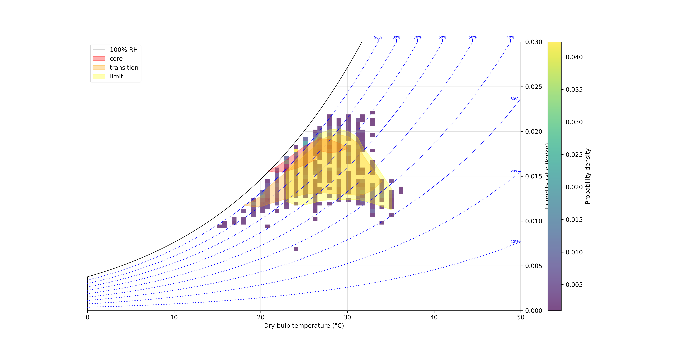

# 🐄 Carga Térmica em Bovinos  
### Análise empírica de conforto térmico em espaço psicrométrico



---

## 📌 O que é este projeto

Este projeto implementa um pipeline científico para estimar **zonas reais de conforto térmico em bovinos leiteiros**, utilizando dados observacionais e análise estatística no espaço psicrométrico (Temperatura × Umidade absoluta).

Ao invés de usar limites fixos (como THI), a abordagem aqui é:

→ baseada no comportamento dos animais  
→ orientada por dados  
→ estatisticamente consistente  

---

## 🧠 Ideia central

O conforto térmico não é binário.

Ele emerge como uma **distribuição de probabilidade** no espaço ambiental.

Por isso, o modelo identifica três regiões:

- 🔴 **Core** → conforto ótimo (maior densidade)
- 🟠 **Transição** → conforto aceitável
- 🟡 **Limite** → zona de tolerância

---

## 🔬 Pipeline

O fluxo do modelo é:
```

raw dataset
↓
padronização
↓
cálculo de carga térmica (THI acumulado)
↓
definição de conforto
↓
extração de períodos contínuos
↓
transformação psicrométrica (T, W)
↓
campo de densidade (2D histogram)
↓
filtragem estatística
↓
segmentação por percentis
↓
extração geométrica (alpha-shape / convex hull)
↓
suavização
↓
plot final

```

---

## 📊 Exemplo de saída

O pipeline gera gráficos como:

- Campo de densidade de conforto
- Curvas psicrométricas
- Polígonos de zona térmica

Arquivo exemplo:

```

app/fig_comfort_polygon.png

````

---

## ⚙️ Instalação

### 1. Clonar repositório

```bash
git clone https://github.com/seu-usuario/carga-termica-bovinos.git
cd carga-termica-bovinos
````

### 2. Criar ambiente

```bash
python -m venv .venv
source .venv/bin/activate
```

### 3. Instalar dependências

```bash
pip install -r requirements.txt
```

---

## 🚀 Execução

### Modo simples

```bash
python app/run_pipeline.py
```

### Modo CLI (recomendado)

```bash
python app/run.py --config app/config.yaml
```

Opções:

```bash
--dataset PATH        # sobrescreve dataset
--no-cluster          # desativa clusterização
--no-smooth           # desativa suavização
```

---

## ⚙️ Configuração

O comportamento do pipeline é totalmente controlado por:

```
app/config.yaml
```

ou pelo schema tipado:


Principais blocos:

* density → resolução e filtragem
* clustering → DBSCAN
* geometry → alpha / convex
* smoothing → suavização visual
* zones → percentis de conforto

---

## 🔬 Interpretação científica

⚠️ IMPORTANTE:

* A densidade representa **dados observados**
* Os polígonos representam **modelo derivado**

Portanto:

```
densidade ≠ modelo
polígono ≠ verdade biológica absoluta
```

---

## 📈 Metodologia-chave

### ✔️ Transformação psicrométrica

Implementada em :

* Remove não-linearidade da umidade relativa
* Usa razão de mistura (W)

---

### ✔️ Segmentação por percentis

Implementada em :

* Core → maior densidade
* Transition → intermediário
* Limit → borda

---

### ✔️ Geometria

Implementada em :

* Convex Hull → baseline
* Alpha Shape → forma realista

---

### ✔️ Suavização

Implementada em :

⚠️ Apenas visual — não usar para análise quantitativa.

---

## 📂 Estrutura

```bash
app/
├── pipeline/        # lógica científica
├── plot/            # visualização
├── config.yaml      # parâmetros
├── run.py           # CLI
└── run_pipeline.py  # execução direta
```

---

## 📄 Licença

LGPL v3

---

## 👨‍🔬 Autor

- João Gerd Zell de Mattos (INPE / CPTEC) 
- Cleicione Moura de Oliveira ( UFAL / PPGESPA ) 

---

## 🚧 Próximos passos

* Integração com psychChart como plugin
* Cálculo de índices (ITU, HLI, UTCI)
* API (FastAPI)
* Dashboard interativo

